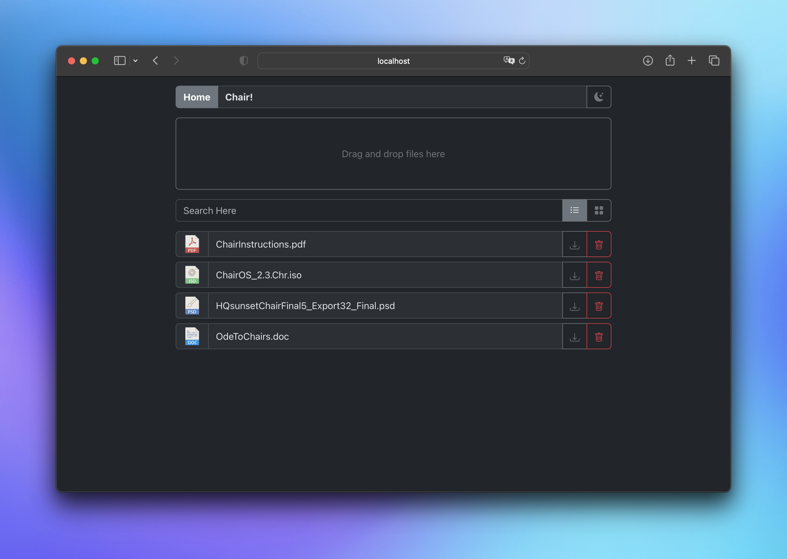

# cbFiles
A simple self-hosted file sharing solution inspired by [ybFeed](https://github.com/ybizeul/ybFeed)

## Fair warning

This is a very early version of the project, and security has not taken the priority yet. Open to internet traffic at your own risk.

## The Project

Drag and drop your files on the drop zone to create a new Share. You can then share the link or share name with whomever you like. You can also search for an existing share by name (or create a new one if it doesn't exist).

The name of a share is not yet editable and is randomly generated.

Once on a share's page you can choose to download the files individually or as a zip archive. You can also delete either individual files or the whole share. Of course you may also search for a specific file by name.



## Installation

### Docker

Coming...

### Manually

Download or clone the repository, then :

```bash
// Download node dependencies
cd web
npm install

// Build the react app
npm run build

// Build the go server
cd ../
go build -o cbFiles server/main.go

// Run the compiled app
./cbFiles
```
or, in one command :

```bash
cd web && npm install && npm run build && cd ../ && go build -o cbFiles server/main.go && ./cbFiles
```

The server will listen on port 8080 by default.

Access the app at `http://localhost:8080` on your browser (on the same machine).

### Behind the scenes

This project is built with React and uses react-bootstrap for UI components. The backend is a simple Go server that stores files in a local directory.